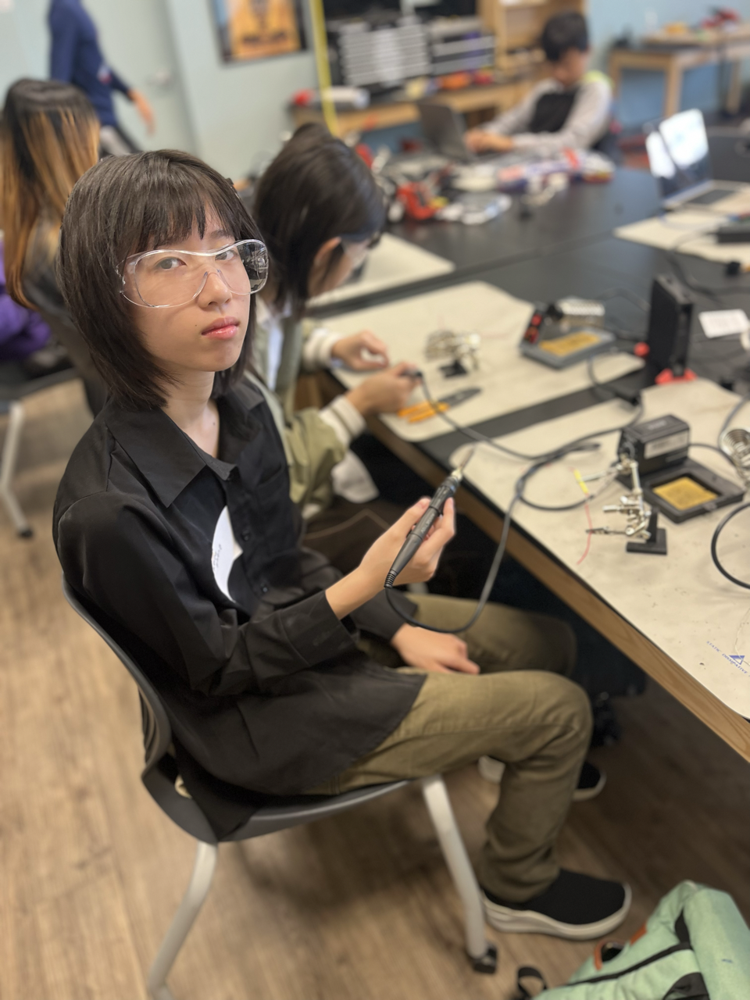

# IOT weather station

 <!---Replace this text with a brief description (2-3 sentences) of your project. This description should draw the reader in and make them interested in what you've built. You can include what the biggest challenges, takeaways, and triumphs from completing the project were. As you complete your portfolio, remember your audience is less familiar than you are with all that your project entails!
You should comment out all portions of your portfolio that you have not completed yet, as well as any instructions:-->

| **Engineer** | **School** | **Area of Interest** | **Grade** |
|:--:|:--:|:--:|:--:|
| Keira | Crystal Springs Uplands School | [Vocal synthesizers](https://www.youtube.com/@ochi-_) | 10th

{: height="30%" width="30%"}

<!---


  
# Final Milestone

**Don't forget to replace the text below with the embedding for your milestone video. Go to Youtube, click Share -> Embed, and copy and paste the code to replace what's below.**

<iframe width="560" height="315" src="https://www.youtube.com/embed/F7M7imOVGug" title="YouTube video player" frameborder="0" allow="accelerometer; autoplay; clipboard-write; encrypted-media; gyroscope; picture-in-picture; web-share" allowfullscreen></iframe>

For your final milestone, explain the outcome of your project. Key details to include are:
- What you've accomplished since your previous milestone
- What your biggest challenges and triumphs were at BSE
- A summary of key topics you learned about
- What you hope to learn in the future after everything you've learned at BSE
-->


# Second Milestone

<iframe width="560" height="315" src="https://www.youtube.com/embed/Kh1x2eZKsNs" title="YouTube video player" frameborder="0" allow="accelerometer; autoplay; clipboard-write; encrypted-media; gyroscope; picture-in-picture; web-share" allowfullscreen></iframe>

My second milestone of making the IOT weather station was to be able to change the color of the NeoPixel ring (the light) depending on the weather. The components of my project have remained exactly the same as my first milestone: a breadboard, wires, a Particle Argon, a USB cable and a 12-pixel NeoPixel ring. This milestone focused mainly on the code for my project, which is why there are no new components.

## CODE

The main part of my code for this project involves a webhook, which is a callback function that allows for easy data communication between 2 applications. I use a webhook from openweather.org in this project, which sends me the data I need, such as the current weather type. Simply put, my code recieves data from an OpenWeather webhook and then searches for certain keywords in the data, such as "clouds," "clear," "thunderstorm," etc. If a certain keyword is detected, the NeoPixel will turn a corresponding color.

## CHALLENGES

I had a lot of trouble with finishing this milestone due to my unfamiliarity with C++ and coding in general. Due to differences between the components I was given and the components in the tutorial, I had to make a lot of modifications and employed a lot of help from the instructors (hard carried). For example, the weather data application the tutorial used, IFTTT, no longer supports Particle, so I had to use a different program and different code (and also modify it). Although it seemed simple in theory, it ended up taking a long time to figure out the code (4+ days I think??), and I'm glad that it's over. My next step will be making the casing for the weather station and starting to work on my modifications. I am planning on installing a screen that displays either the current temperature or type of weather.

# First Milestone

<iframe width="560" height="315" src="https://www.youtube.com/embed/3AICoT2wqAA" title="YouTube video player" frameborder="0" allow="accelerometer; autoplay; clipboard-write; encrypted-media; gyroscope; picture-in-picture; web-share" allowfullscreen></iframe>
My final project is the IOT weather station, which is a glorified lamp that changes color depending on the weather. My first milestone was to make the light of the lamp turn on, which it does.

## COMPONENTS

So far, my project consists of a breadboard, various wires, a Particle Argon, a USB cord, and a 12-pixel NeoPixel ring. I do have the rest of the components (the jar and cotton wool), but I will use them much later. Currently, I have the Argon installed on the breadboard, and it is also connected to the NeoPixel light. It recieves power from a USB cord connected to my computer. Here are brief descriptions of the components I have:
- breadboard: connects the components, lets power from the computer go to the NeoPixel through wires
- Particle Argon: a wifi development kit for building connection-reliant projects
- USB cable: carries power from my computer to the Argon.
- 12-pixel NeoPixel ring: a ring with 12 individual lights on it
- wires: carries the power from the computer through the breadboard

## CHALLENGES

When first starting out on this project, I had absolutely no idea what I was doing, and all of the components were either completely new or barely familliar to me. I wasted a lot of time just being confused and not really doing anything as a result. In my opinion, I had the most trouble regarding the Argon. For example, the tutorial I was given used the Photon instead of the Argon, which caused me a lot of confusion due to the Argon being able to handle less voltage (3.3v) compared to the Photon (5v). This also meant that I had to rework some of the wires and remove some things in general, which I also had some issues with due to my lackluster knowledge of circuitry. All previous knowledge I had of C++ completely vanished, so even when I had finished placing down all the components correctly, I still had to spend a lot of time on figuring out how to check that the project worked. Overall, so far this project has made me feel mildly lacking in the intelligence department. In order to complete my project, I will need to make the lights change according to current weather data, which will be my next step.


# Starter Project

{: height="30%" width="30%"}
<iframe width="560" height="315" src="https://www.youtube.com/embed/bR8ie5K5Cio" title="YouTube video player" frameborder="0" allow="accelerometer; autoplay; clipboard-write; encrypted-media; gyroscope; picture-in-picture; web-share" allowfullscreen></iframe>

## SUMMARY

This starter project is the useless box, a box that genuinely has no purpose and is, as its name implies, useless. Its only function is to turn itself off. The useless box is comprised of various components including a motor, arm, switch, and box parts. In general terms, when the switch is flipped, the motor is activated and turns the arm up, which un-flips the switch and lets the arm go back down. This project was relatively easy to create, as the instructions were simple and had effective diagrams. 

## COMPONENTS

-  laser-cut acrylic parts (used to construct the 'box' part of the useless box)
-  laser-cut wood piece that says 'useless box' (decoration)
-  door with hinge rod (the arm pushes it up every time it goes up, like a small turtle)
-  arm (used to flip the switch. it's attached to the motor spindle, so its rotation is controlled by the motor.)
-  motor mount parts (encloses the motor. shapes let them lock to the bottom of the box and attach to different components via screws.)
-  2" corner posts (supports the walls of the box. screws into the top/bottom of it.)
-  weld nuts/(self-tapping) screws/washers/switch nut & washer (attaches components together or helps reduce friction)
-  PCB board (contains all the circuitry needed to run the useless box)
-  3x AAA battery pack (holds 3 AAA batteries. powers the motor and connects to the PCB board)
-  adhesive velcro (attaches the battery pack to the bottom of the box)
-  motor (I'm not sure what kind of motor it is, but it has nubs/shapes on it that fit around the motor mount parts.)
-  resistors (used to provide a specific voltage to the motor?)
-  switch (the 'activator' of the useless box. when flipped, the box turns on.)
-  screw terminals (connects the battery pack and the motors to the PCB. lets the battery distribute energy and the motor recieve energy.)
-  led (for decoration. turns green when the arm rotates up and turns red when the arm rotates down.)
-  snap switch (used to detect when the arm has returned to its original position, turning off the LED.)

The useless machine works in this way: when the switch on top is flipped, the motor is activated using energy from the battery pack, which turns the LED on and makes it green. Since the arm is attached to the motor spindle, the arm rotates up until it reverses the switch, whitch turns the LED red and rotates the arm back down. When the arm goes back to its 'resting' position, it hits a snap switch on the bottom of the PCB, which turns off the LED.
  
## CHALLENGES

The most challenging parts of creating the useless box were learning how to solder and getting the box of the useless box around its mechanisms. All in all, I enjoyed making this project. I have named the box "pablo box" due to how pablo (the arm) lives in the box.

## NEXT STEPS

My next step will be working on the final project that I chose: a weather indicator with IOT. It is a little jar with a light that changes color based on the weather.

<!---
# Schematics 
Here's where you'll put images of your schematics. [Tinkercad](https://www.tinkercad.com/blog/official-guide-to-tinkercad-circuits) and [Fritzing](https://fritzing.org/learning/) are both great resoruces to create professional schematic diagrams, though BSE recommends Tinkercad becuase it can be done easily and for free in the browser. 

# Code
Here's where you'll put your code. The syntax below places it into a block of code. Follow the guide [here]([url](https://www.markdownguide.org/extended-syntax/)) to learn how to customize it to your project needs. 

```c++
#include <oled-wing-adafruit.h>
#include <neopixel.h>
#include <oled-wing-adafruit.h>
#include "Particle.h"

SYSTEM_MODE(AUTOMATIC);

#define PIXEL_COUNT 12
#define PIXEL_PIN D4
#define PIXEL_TYPE WS2812B
 
Adafruit_NeoPixel stripA = Adafruit_NeoPixel(PIXEL_COUNT, PIXEL_PIN, PIXEL_TYPE);
OledWingAdafruit oled;

SerialLogHandler logHandler;

void subscriptionHandler(const char *event, const char *data);

SYSTEM_THREAD(ENABLED);

const char *EVENT_NAME = "getweatherdata2";

enum {
    STATE_WAIT_FOR_CONNECTED,
    STATE_WAIT_TO_PUBLISH,
    STATE_IDLE
};
int state = STATE_WAIT_FOR_CONNECTED;
unsigned long stateTime;

void setup() {
    String subscriptionName = String::format("%s/%s/", System.deviceID().c_str(), EVENT_NAME);
    Particle.subscribe(subscriptionName, subscriptionHandler, MY_DEVICES);
    Log.info("subscribing to %s", subscriptionName.c_str());
    stripA.begin();
    stripA.show();
    
    oled.setup(); 
    oled.clearDisplay();
    oled.display();
}

void loop() {
    switch(state) {
        case STATE_WAIT_FOR_CONNECTED:
            if (Particle.connected()) {
                state = STATE_WAIT_TO_PUBLISH;
                stateTime = millis();
            }
            break;

        case STATE_WAIT_TO_PUBLISH:
            if (millis() - stateTime >= 5000) {
                Particle.publish(EVENT_NAME, "", PRIVATE);
                state = STATE_IDLE;
            }
            break;

        case STATE_IDLE:
            break;
    }
}

void displayWeather() {
    oled.clearDisplay();
    oled.setTextSize(2);
    oled.setTextColor(WHITE);
    oled.setCursor(0,0);
}

void subscriptionHandler(const char *event, const char *data) {
    JSONValue outerObj = JSONValue::parseCopy(data);

displayWeather();
    JSONObjectIterator iter(outerObj);
    while(iter.next()) {
        if (iter.value().isArray()) {
            JSONArrayIterator iter2(iter.value());
            int index = 0;
            while(iter2.next()) {
                JSONObjectIterator iter3(iter2.value());
                while(iter3.next()) {
                    Log.info("%s index=%d key=%s value=%s", 
                        (const char *) iter.name(),
                        index,
                        (const char *) iter3.name(), 
                        (const char *) iter3.value().toString());
                    if (iter3.value().toString() == "Clouds") {
                        for(int i = 0; i < PIXEL_COUNT; i++) {
                            stripA.setPixelColor(i, 30,30,30);
                        stripA.show();
                        }
                    }else if (iter3.value().toString() == "Rain") {
                        for(int i = 0; i < PIXEL_COUNT; i++) {
                            stripA.setPixelColor(i, 30,30,80);
                        stripA.show();
                        }
                    }else if (iter3.value().toString() == "Drizzle") {
                        for(int i = 0; i < PIXEL_COUNT; i++) {
                            stripA.setPixelColor(i, 60, 60, 90);
                        stripA.show();
                        }
                    }else if (iter3.value().toString() == "Thunderstorm") {
                        for(int i = 0; i < PIXEL_COUNT; i++) {
                            stripA.setPixelColor(i, 20,20,60);
                        stripA.show();
                        }
                    }else if (iter3.value().toString() == "Clear") {
                        for(int i = 0; i < PIXEL_COUNT; i++) {
                            stripA.setPixelColor(i, 100, 40, 0);
                        stripA.show();
                        }
                    }else if (iter3.value().toString() == "Snow") {
                        for(int i = 0; i < PIXEL_COUNT; i++) {
                            stripA.setPixelColor(i, 30,30,30);
                        stripA.show();
                        }
                    }else if (iter3.value().toString() == "Mist" or iter3.value().toString() == "Smoke" or iter3.value().toString() == "Haze" or iter3.value().toString() == "Dust" or iter3.value().toString() == "Fog" or iter3.value().toString() == "Sand" or iter3.value().toString() == "Ash" or iter3.value().toString() == "Squall") {
                        for(int i = 0; i < PIXEL_COUNT; i++) {
                            stripA.setPixelColor(i, 120,120,30);
                        stripA.show();
                        }
                    }else if (iter3.value().toString() == "Tornado") {
                        for(int i = 0; i < PIXEL_COUNT; i++) {
                            stripA.setPixelColor(i, 255, 0, 0);
                        stripA.show();
                        }
                }
                index++;
            }
        }
        }else {
            Log.info("key=%s value=%s", 
                (const char *) iter.name(), 
                (const char *) iter.value().toString());
                if (iter.name() == "temp") {
                    Serial.println((const char *) iter.value().toString());
                    oled.print("temp:");
                    oled.println((const char *) iter.value().toString());
                }
                else if (iter.name() == "main") {
                    if (iter.value().toString() == "Clouds") {
                        oled.println("cloudy :)");
                    }
                    if (iter.value().toString() == "Rain") {
                        oled.println("rain :(");
                    }
                    if (iter.value().toString() == "Drizzle") {
                        oled.println("drizzle");
                    }
                    if (iter.value().toString() == "Thunderstorm") {
                        oled.println("thunder");
                    }
                    if (iter.value().toString() == "Clear") {
                        oled.println("clear :D");
                    }  
                    if (iter.value().toString() == "Snow") {
                        oled.println("snow??");
                    }
                    if (iter.value().toString() == "Mist" or iter.value().toString() == "Smoke" or iter.value().toString() == "Haze" or iter.value().toString() == "Dust" or iter.value().toString() == "Fog" or iter.value().toString() == "Sand" or iter.value().toString() == "Ash" or iter.value().toString() == "Squall") {
                        oled.println("HUH");
                    }  
                    if (iter.value().toString() == "Tornado") {
                        oled.println("run");
                    }  
                    oled.display();
                }
        }
    }
}

```
# Bill of Materials
Here's where you'll list the parts in your project. To add more rows, just copy and paste the example rows below.
Don't forget to place the link of where to buy each component inside the quotation marks in the corresponding row after href =. Follow the guide [here]([url](https://www.markdownguide.org/extended-syntax/)) to learn how to customize this to your project needs. 

| **Part** | **Note** | **Price** | **Link** |
|:--:|:--:|:--:|:--:|
| Item Name | What the item is used for | $Price | <a href="https://www.amazon.com/Arduino-A000066-ARDUINO-UNO-R3/dp/B008GRTSV6/"> Link </a> |
| Item Name | What the item is used for | $Price | <a href="https://www.amazon.com/Arduino-A000066-ARDUINO-UNO-R3/dp/B008GRTSV6/"> Link </a> |
| Item Name | What the item is used for | $Price | <a href="https://www.amazon.com/Arduino-A000066-ARDUINO-UNO-R3/dp/B008GRTSV6/"> Link </a> |

# Other Resources/Examples
One of the best parts about Github is that you can view how other people set up their own work. Here are some past BSE portfolios that are awesome examples. You can view how they set up their portfolio, and you can view their index.md files to understand how they implemented different portfolio components.
- [Example 1](https://trashytuber.github.io/YimingJiaBlueStamp/)
- [Example 2](https://sviatil0.github.io/Sviatoslav_BSE/)
- [Example 3](https://arneshkumar.github.io/arneshbluestamp/)-->
